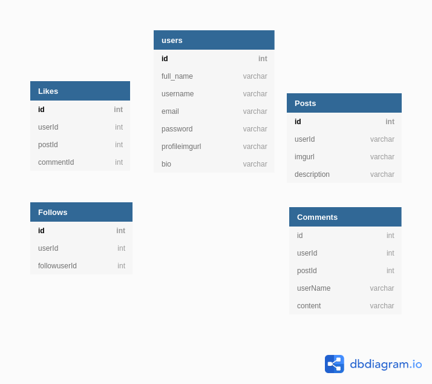

# *** Flexagram***

## Flexagram, a social media platform!

Flexagram is a full-stack social media platform where you can share, like and comment photos with your friends.

*Note: This is a demo, and is still in production.*

## Latest Release

*Flexagram can be found at [https://flexagram.herokuapp.com/](https://flexagram.herokuapp.com/).*

## MVP Features
- A reverse chronological data feed that renders the latests posts first.
- Upload images to an AWS S3 bucket.
- Fluid display of likes, comments and posts without having to reload the page.

## Technologies Used
    - Frontend
        - React
        - Javascript
        - Redux
        - Material UI - React Components
        - React-dropzone
    -Backend
        - Flask
        - Python
        - Postgres
        - SQLAlchemy
        - Alembic
        - AWS S3
        - Heroku deployment via Docker

## Troubleshooting

## Database Schema

## Created By 
- [Johnny Bui](https://github.com/JBui923)

